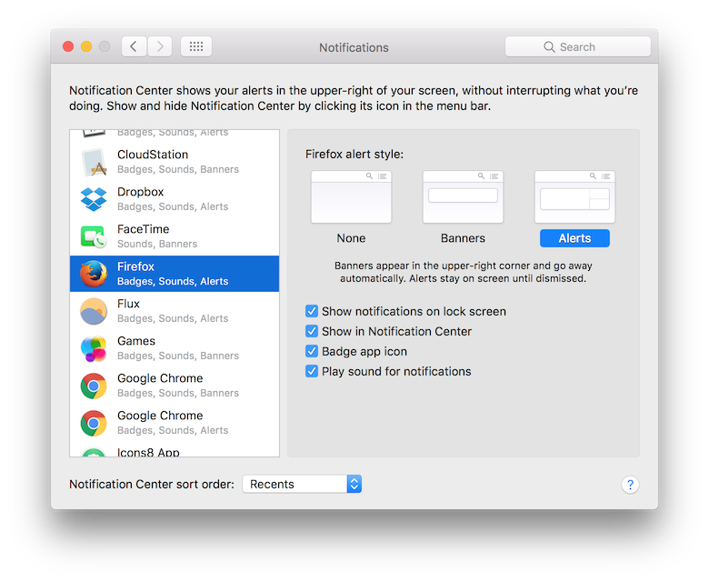
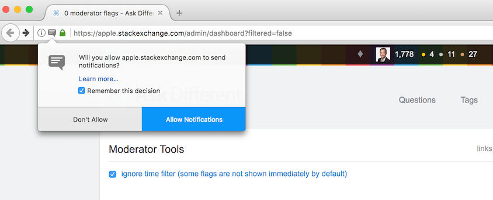
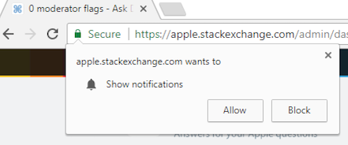
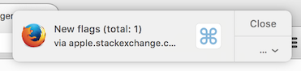
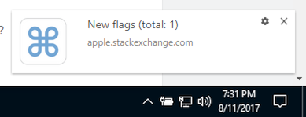

# Admin Flag Notifier

This userscript monitors the moderator flag queue and sends you a desktop notification
when new flags arrive, so that you don't have to refresh the page manually.

## Features

- The script is only active when the flag queue is open; once you navigate away, it won't
bother you anymore.
- It checks the current status of the queue every 60 seconds.
- Due to the expected number of flags, Stack Overflow moderators are advised not to use
the script. It may harm your sanity.

## Installation

- Make sure you have Tampermonkey (for Chrome) or Greasemonkey (for Firefox) installed.

- Install the userscript with
[this direct link](https://raw.githubusercontent.com/Glorfindel83/SE-Userscripts/master/admin-flag-notifier/admin-flag-notifier.user.js).

- If you're on a Mac, you might need to change the notification style for your browser. I
personally found it annoying that banners disappeared so fast; to solve that, go to System
Preferences -> Notifications, select your browser and make sure the alert style is set to
Alerts as in the picture below:

  

- Navigate to the flag queue (/admin/dashboard). The browser will ask you to give
permission for notifications, so click Allow:

  

  

- Wait for some flags. Once the script detects new flags, a notification will appear:

  

  

  Click on the body of the notification, it will focus on the tab with the flag queue and refresh the page.
