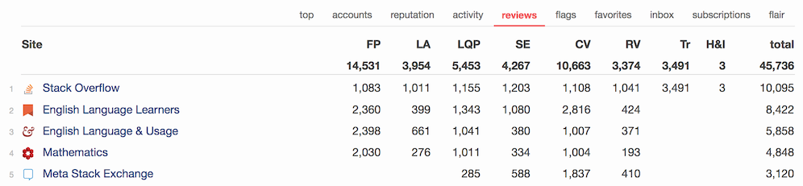

# Global Review Summary

This script adds a 'reviews' tab to your network profile, which will show your review
totals across the network.

## Installation

- Install the userscript with
[this direct link](https://raw.githubusercontent.com/Glorfindel83/SE-Userscripts/master/global-review-summary/global-review-summary.user.js).

developed & tested with Violentmonkey on Firefox

## Support

If you have any questions, please post a comment on [this Stack Apps question](https://stackapps.com/q/7723/34061).

## Attribution

The code of this userscript leans heavily on the
[Stack Exchange Global Flag Summary](https://stackapps.com/q/7173/34061) script by Floern.
