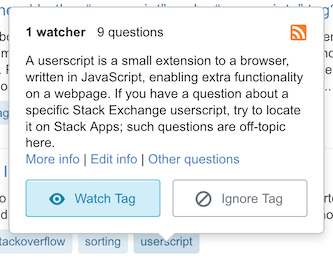

# Improved Tag Popup

Inspired by [this feature request by Andrew Leach](https://meta.stackexchange.com/q/314150/295232),
this script adds some extra links in the new tag popup,
to view and edit the full tag information (wiki and excerpt).

## Installation

- Install the userscript with
[this direct link](https://raw.githubusercontent.com/Glorfindel83/SE-Userscripts/master/improved-tag-popup/improved-tag-popup.user.js).

developed & tested with Violentmonkey on Firefox

## Support

If you have any questions, please post a comment on [this Stack Apps question](https://stackapps.com/q/8054/34061).
