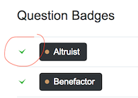

# You've Earned This Badge, but when and where?

This userscript turns the checkmarks in the badge list (which indicate you've earned a
specific badge) to links to your *personal* badge page, where you can see when and where
you earned the badge

 
 
 

## Installation

- Make sure you have Tampermonkey (for Chrome) or Greasemonkey (for Firefox) installed.

- Install the userscript with
[this direct link](https://raw.githubusercontent.com/Glorfindel83/SE-Userscripts/master/you-earned-this-badge/you-earned-this-badge.user.js).

## Support

- Stack Apps